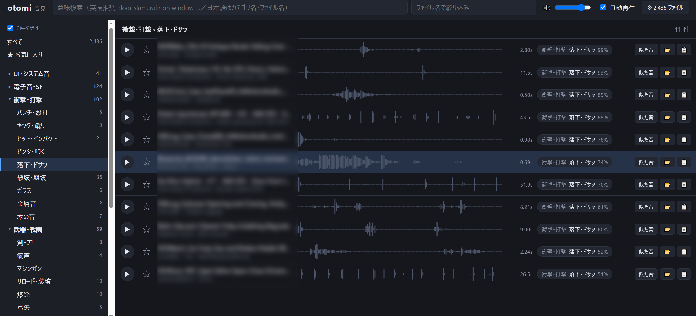

# otomi（音見）

[English](README.md) | **日本語**

> 効果音ライブラリを AI で自動カテゴライズし、言葉や「似た音」で探せるローカルツール

効果音を何千、何万と集めていると、「あの音どこだっけ」となりがちです。
otomi は、フォルダ内の音声ファイルを [CLAP](https://github.com/LAION-AI/CLAP)（Contrastive Language-Audio Pretraining：音声とテキストを同じベクトル空間に写像するモデル）で解析します。
音そのものの中身を見て、ファイル名や既存のフォルダ構成に頼らずに整理・検索できます。



> **ステータス: alpha。** 動作はしますが、仕様や DB の形式は今後変わる可能性があります。

## 特長

- 📁 **フォルダを登録するだけ**：サブフォルダも含めて再帰的にスキャンします。2 回目以降は、追加・変更されたファイルだけを解析します
- 🏷 **自動カテゴリ分け**：16 グループ・約 120 カテゴリ（UI 音・衝撃・武器・魔法・人の声・動物・自然・環境音・乗り物・生活音・ホラー・楽器など）に振り分けます
- 🔎 **言葉で検索**：`door slam` や `rain on a window` のような説明文で、意味の近い音を探せます
- 🔁 **似た音検索**：選んだ音に近い音を一覧にします
- 🎧 **すばやい試聴**：波形つきのリストで、↑↓ キーを押すたびに自動再生します
- ✏ **手動修正とお気に入り**：AI の判定が違えばカテゴリを直せます。★ も付けられます
- 🖱 **ドラッグ&ドロップ**：リストの行を DAW・動画編集ソフト・エクスプローラーへドラッグできます（Chrome / Edge）
- 🔒 **完全ローカル**：音声ファイルを外部に送信しません。元ファイルも変更しません
- 📤 **書き出し**：分類結果を CSV や、カテゴリ別フォルダ（コピー／ハードリンク）に出力できます

対応形式：wav / mp3 / flac / ogg / opus / aiff / m4a / aac / wma / caf

## 動作環境

- Windows / macOS / Linux
- [uv](https://docs.astral.sh/uv/)（Python 3.12 と依存ライブラリを自動で用意します）
- NVIDIA GPU を推奨（CPU のみでも動きますが、解析に時間がかかります）
- ディスク空き容量：PyTorch とモデルで数 GB
- 初回起動時に CLAP モデル（約 800MB）を Hugging Face から自動ダウンロードするため、インターネット接続が必要です

参考までに、GTX 1650（VRAM 4GB）での解析速度は約 5 ファイル/秒です。

## インストール

```bash
git clone https://github.com/rosiro/otomi.git
cd otomi
uv sync
```

`pyproject.toml` は、既定で **CUDA 12.6 版の PyTorch** をインストールする設定になっています。

- **GPU がない場合／macOS の場合**：`pyproject.toml` の `[tool.uv.sources]` と `[[tool.uv.index]]` のブロックを削除してから `uv sync` を実行してください。PyPI の通常版が入り、CPU で動作します。
- **別の CUDA バージョンを使う場合**：`url = "https://download.pytorch.org/whl/cu126"` の `cu126` の部分を、環境に合わせて書き換えてください。

## 使い方

```bash
uv run otomi serve
```

Windows では `otomi.bat` をダブルクリックしても起動できます。

1. ブラウザで `http://127.0.0.1:8765/` が開きます（初回はモデルのダウンロードと読み込みに数分かかります）
2. 右上の ⚙ を押し、効果音フォルダのパスを入力して「追加して解析」を押します
3. 解析が進むにつれて、左側のカテゴリに件数が表示されていきます
4. カテゴリをクリックしたり検索語を入力したりして、音を探します

サーバーは `127.0.0.1` だけで待ち受けるので、ほかの PC からはアクセスできません。

### 画面の操作

| 操作 | 内容 |
| --- | --- |
| 行をクリック / ↑↓ | 選択して再生（「自動再生」がオンのとき） |
| Space | 再生・停止 |
| 波形をクリック | その位置から再生 |
| S | 選択中の音に似た音を探す |
| F | お気に入りの切り替え |
| E | エクスプローラー（Finder）でファイルを表示 |
| / | 検索欄へ移動 |
| Esc | メニュー・ダイアログを閉じる |
| カテゴリのラベルをクリック | カテゴリを手動で変更（AI の上位 3 候補と確率も表示） |
| 行をドラッグ | DAW やフォルダへファイルをドロップ（Chrome / Edge） |

### 検索のコツ

CLAP のテキストエンコーダは英語で学習されているため、**意味検索は英語で入力**してください。

- `footsteps on gravel`、`sword clash`、`cute pop`、`sci-fi door open` のように、具体的に書くほど精度が上がります
- 日本語で入力した場合は、まずカテゴリ名（例：`雨`、`爆発`、`足音`）と照合します。該当すればそのカテゴリの説明文で意味検索し、該当しなければファイル名で検索します
- 検索欄の右側の入力欄は、ファイル名での絞り込み専用です（日本語のファイル名にも使えます）
- カテゴリを選んだまま検索すると、そのカテゴリの中で意味の近い順に並びます

## コマンドライン

```bash
uv run otomi add "D:\SE"              # フォルダを登録して解析
uv run otomi index                     # 登録フォルダを再スキャン（新規・変更分のみ）
uv run otomi index --retry-errors      # 読み込みに失敗したファイルも再試行
uv run otomi roots                     # 登録フォルダの一覧
uv run otomi remove "D:\SE"            # 登録を解除（ファイルは削除しない）
uv run otomi search "glass breaking"   # ターミナルで検索
uv run otomi categories                # カテゴリ別の件数
uv run otomi export-csv result.csv     # 分類結果を CSV に出力
uv run otomi export-folders D:\SE_sorted --mode hardlink   # カテゴリ別フォルダに書き出し
uv run otomi serve --port 9000 --no-browser --no-scan
```

`export-folders` は、`グループ/カテゴリ/ファイル名` の構成で書き出します。
`--mode hardlink` を付けると、同じドライブ内ならディスク容量を使わずに書き出せます。

## カテゴリのカスタマイズ

```bash
uv run otomi init-categories   # 既定の定義を data/categories.toml にコピー
```

`data/categories.toml` を編集したら、設定画面の「カテゴリを再読み込み」を押してください。すぐに反映されます。
音声のベクトルは保存済みで、やり直すのはカテゴリとの照合だけなので、**音声の再解析は不要**です。

```toml
[horror]
name = "ホラー・不気味"
[horror.items]
creak = { name = "きしみ", prompts = ["creaking wood", "creaky floorboard"] }
```

- `name` は画面に表示する名前です（日本語可）
- `prompts` には英語の説明文を書きます。言い換えを複数並べると、判定が安定します

## 設定（環境変数）

| 変数 | 既定値 | 内容 |
| --- | --- | --- |
| `OTOMI_HOME` | `./data` | DB とユーザー設定の保存先 |
| `OTOMI_MODEL` | `laion/larger_clap_general` | 使用する CLAP モデル（`laion/clap-htsat-unfused` など）。変更すると全ファイルを再解析します |
| `HF_HUB_OFFLINE` | – | `1` にすると、モデル更新の確認をせずにローカルのキャッシュだけを使います |

解析結果（`data/otomi.db`）には、登録したフォルダのパスやファイル名が含まれます。リポジトリにはコミットしないでください（`.gitignore` で除外する想定です）。

## 仕組み

1. 音声を 48kHz モノラルに変換し、10 秒以内のクリップにします（長い音は均等な位置から最大 4 か所を切り出します）
2. CLAP の音声エンコーダで 512 次元のベクトルに変換し、SQLite に保存します（長い音は各クリップのベクトルを平均します）
3. 各カテゴリの英語説明文をテキストエンコーダでベクトル化し、音声ベクトルとのコサイン類似度で最も近いカテゴリに分類します（ゼロショット分類）
4. 検索語も同じようにベクトル化し、類似度の高い順に並べます。「似た音」は音声ベクトル同士の類似度です

## 既知の制限

- 意味検索は英語のみです（CLAP の制約）
- 分類は学習なしのゼロショットなので、似たカテゴリ（例：「ヒット」と「パンチ」）は取り違えることがあります。必要に応じて手動で修正するか、`prompts` を調整してください
- 1 ファイルにつき 1 カテゴリに分類します（複数タグには未対応）
- 300 秒を超える長いファイルは、先頭 300 秒だけを解析します
- ドラッグ&ドロップでのファイル書き出しは、Chromium 系ブラウザ（Chrome / Edge）だけで動きます

## 開発

```bash
uv sync            # dev 依存（pytest など）も入ります
uv run pytest      # CLAP モデルを使わない高速なテスト
```

| ファイル | 役割 |
| --- | --- |
| `otomi/audio.py` | 音声の読み込み・リサンプリング・波形サムネイル |
| `otomi/model.py` | CLAP モデル（Hugging Face transformers）のラッパー |
| `otomi/indexer.py` | フォルダの走査と埋め込みの計算 |
| `otomi/categories.py` / `categories.toml` | カテゴリ定義とゼロショット分類 |
| `otomi/library.py` | メモリ上での分類・検索 |
| `otomi/db.py` | SQLite への保存 |
| `otomi/server.py` / `otomi/static/` | Web UI（FastAPI + 素の HTML/JS） |
| `otomi/cli.py` | コマンドライン |

## 謝辞

- [LAION-AI/CLAP](https://github.com/LAION-AI/CLAP)：既定で使用するモデル [`laion/larger_clap_general`](https://huggingface.co/laion/larger_clap_general) は Apache-2.0 ライセンスです。モデルはこのリポジトリには含まれず、実行時に Hugging Face からダウンロードされます
- [Hugging Face Transformers](https://github.com/huggingface/transformers)、[PyTorch](https://pytorch.org/)、[FastAPI](https://fastapi.tiangolo.com/)、[python-soundfile](https://github.com/bastibe/python-soundfile)、[PyAV](https://github.com/PyAV-Org/PyAV)、[python-soxr](https://github.com/dofuuz/python-soxr)
